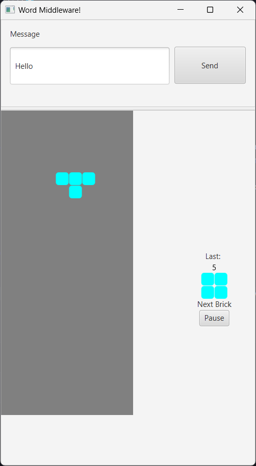
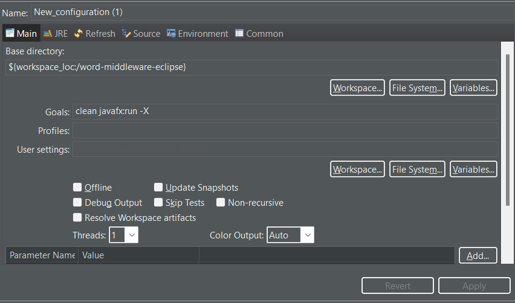
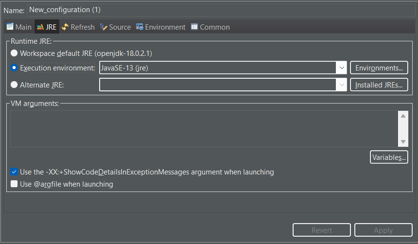
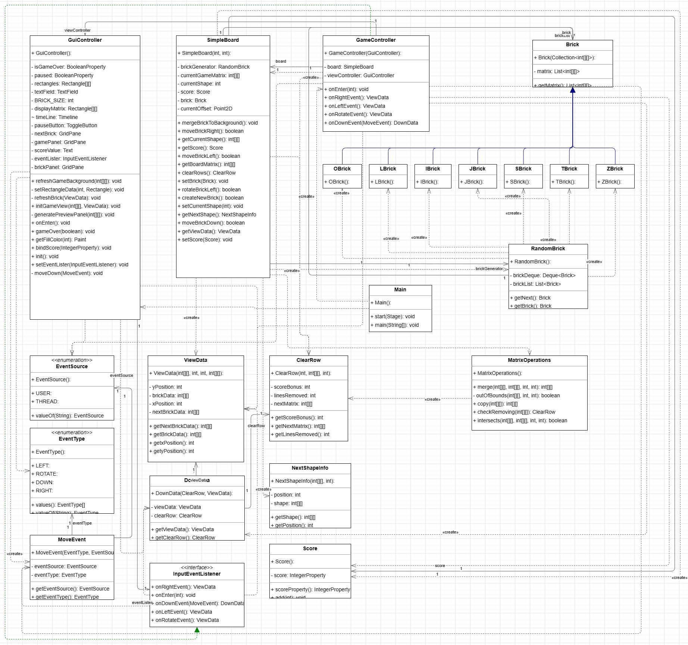

- [x]  🔼 📅 2023-11-12 ✅ 2023-11-12

---

## Realizácia zadania „Gamifikácia"

<div style="display: grid; grid-template-columns: repeat(2, minmax(0, 1fr)); gap: 2rem;">
<div>

Našou úlohou bolo **gamifikovať nejaký proces nášho života**.

Po dlhom premýšľaní som prišiel na nápad, ako vyriešiť jeden globálny problém v komunikácii – obrovské množstvo
nezmyselného textu, ktorého musia ľudia prečítať tony.

Rozhodol som sa nejakým spôsobom vytvoriť nástroj na písanie čistého a jasného textu (správy). Teda, ako povedal Joseph
Sheridan, britský spisovateľ 18. a 19. storočia - _"Stručnosť je kľúčom k jasnosti."_.

Takže na stroji vznikol program, ktorý spúšťa mini hru (Tetris) na základe náročnosti vášho textu (počtu písmen), ktorý
je potrebné absolvovať, aby bolo možné poslať správu.

### Vybrané technológie

- `openjdk-18.0.2.1`
- `javaFx`
    - Pre grafické rozhranie.
- `maven`
    - Nástroj na zostavovanie, ktorý uľahčuje správu závislostí a zostavovanie projektu.

</div>
<aside>



</aside>
</div>

### Spustenie programu (Eclipse)

<div style="display: grid; grid-template-columns: repeat(2, minmax(0, 1fr)); gap: 2rem;">





</div>

### UML Diagram



## `pouziteOopPrincipy.pdf`

### Zmysluplné hierarchie dedenia

`IBrick.java`

```java
public class IBrick /*- ZBrick*/ extends Brick {
    public IBrick /*- ZBrick*/() {
        super(new ArrayList<>() {{
            // ...
        }});
    }
}
```

### Zapuzdrenie a správne modifikátory prístupu (členské premenné sú private)

```java
public class GameController implements InputEventListener {
    private final SimpleBoard board = new SimpleBoard(25, 10);
    private final GuiController viewController;

    protected GameController(GuiController c) {
        this.viewController = c;
        this.viewController.setEventLister(this);
    }
}
```

_etc... in all classes._

### Použitie preťažovanie (overloading) metód

```java
public class NextShapeInfo {
    public NextShapeInfo(int[][] shape) {
        this.shape = shape;
        this.position = 0;
    }

    public NextShapeInfo(int[][] shape, int position) {
        this.shape = shape;
        this.position = position;
    }
}
```

### Použitie prekonávanie (overriding) metód

```java
public class GameController implements InputEventListener {
    @Override
    public void onEnter(int length) {
        // ...
    }

    @Override
    public DownData onDownEvent(MoveEvent event) {
        // ...
    }

    @Override
    public ViewData onLeftEvent() {
        // ...
    }

    @Override
    public ViewData onRightEvent() {
        // ...
    }

    @Override
    public ViewData onRotateEvent() {
        // ...
    }
}
```

```java
public class Main extends Application {
    @Override
    public void start(Stage stage) throws IOException {
        // ...
    }
}
```

```java
public class GuiController {
    public void init() {
        gamePanel.setOnKeyPressed(new EventHandler<KeyEvent>() {
            @Override
            public void handle(KeyEvent event) {
                if (paused.getValue() == Boolean.FALSE && isGameOver.getValue() == Boolean.FALSE) {
                    if (event.getCode() == KeyCode.UP || event.getCode() == KeyCode.W) {
                        refreshBrick(eventLister.onRotateEvent());
                        event.consume();
                    }
                    if (event.getCode() == KeyCode.DOWN || event.getCode() == KeyCode.S) {
                        moveDown(new MoveEvent(EventType.DOWN, EventSource.USER));
                        System.out.println("Down");
                        event.consume();
                    }
                    if (event.getCode() == KeyCode.LEFT || event.getCode() == KeyCode.A) {
                        refreshBrick(eventLister.onLeftEvent());
                        event.consume();
                    }
                    if (event.getCode() == KeyCode.RIGHT || event.getCode() == KeyCode.D) {
                        refreshBrick(eventLister.onRightEvent());
                        event.consume();
                    }
                }

                if (event.getCode() == KeyCode.P) {
                    pauseButton.selectedProperty().setValue(!pauseButton.selectedProperty().getValue());
                }
            }
        });

        pauseButton.selectedProperty().addListener(new ChangeListener<Boolean>() {
            @Override
            public void changed(ObservableValue<? extends Boolean> observable, Boolean oldValue, Boolean newValue) {
                if (newValue) {
                    timeLine.pause();
                    pauseButton.setText("Resume");
                } else {
                    timeLine.play();
                    pauseButton.setText("Pause");
                }
            }
        });
    }
}
```

```java
public abstract class Brick {
    @Override
    public int hashCode() {
        // ...
    }

    @Override
    public boolean equals(Object obj) {
        // ...
    }

    @Override
    public String toString() {
        // ...
    }
}
```

### Default method

```java
public interface InputEventListener {

  default void onDownEvent() throws ExemptionMechanismException {
    throw new ExemptionMechanismException();
  }
  
  //...
}
```

### Abstract method

```java
public abstract class Brick {
    //...

    abstract String getBrickName();
}
```

```java
public class IBrick extends Brick {
    //...

    @Override
    String getBrickName() {
        return this.getClass().getName();
    }
}
```

### Použitie vzťahu agregácie

```java
public class GuiController {
    @FXML
    private ToggleButton pauseButton;
    @FXML
    private GridPane gamePanel;
    @FXML
    private GridPane nextBrick;
    @FXML
    private GridPane brickPanel;
    @FXML
    private Text scoreValue;
    @FXML
    private TextField textField;
}
```

```java
public class GameController implements InputEventListener {
    private final SimpleBoard board = new SimpleBoard(25, 10);
    private final GuiController viewController;
}
```

```java
public class RandomBrick {
    private final List<Brick> brickList;
    private final Deque<Brick> brickDeque = new ArrayDeque<>();
}
```

_etc..._

### Použitie vzťahu kompozície

```java
public class GuiController {
    Timeline timeLine;

    public void initGameView(int[][] boardMatrix, ViewData viewData) {
        timeLine = new Timeline(
                new KeyFrame(Duration.millis(400), ae -> moveDown(new MoveEvent(EventType.DOWN,
                        EventSource.THREAD))));
        timeLine.setCycleCount(Timeline.INDEFINITE);
        timeLine.play();
    }
}
```

### Použitie vzťahu asociácie

```java
public class GameController implements InputEventListener {
    private final SimpleBoard board = new SimpleBoard(25, 10);
}
```

### Použitie finálny atribút a metódu

```java
public abstract class Brick {
    private final List<int[][]> matrix = new ArrayList<>();

    public final List<int[][]> getMatrix() {
        return matrix;
    }
}
```

```java
public class GuiController {
    private static final int BRICK_SIZE = 20;
    private final BooleanProperty paused = new SimpleBooleanProperty();
    private final BooleanProperty isGameOver = new SimpleBooleanProperty();
    Timeline timeLine;
    private InputEventListener eventLister;
    private Rectangle[][] displayMatrix;
    private Rectangle[][] rectangles;

    @FXML
    private ToggleButton pauseButton;
    @FXML
    private GridPane gamePanel;
    @FXML
    private GridPane nextBrick;
    @FXML
    private GridPane brickPanel;
    @FXML
    private Text scoreValue;
    @FXML
    private TextField textField;
}
```

### Použitie abstraktnej triedu

```java
public abstract class Brick {
}
```

### Použitie statickej metódu a atribútu

```java
public class MatrixOperations {
    public static boolean intersects(int[][] matrix, int[][] brick, int x, int y) {
        // ...
    }

    public static int[][] merge(int[][] filledFields, int[][] brick, int x, int y) {
        // ...
    }

    public static int[][] copy(int[][] original) {
        // ...
    }

    private static boolean outOfBounds(int[][] matrix, int targetX, int targetY) {
        // ...
    }

    public static ClearRow checkRemoving(int[][] matrix) {
        // ...
    }
}
```

```java
public class GuiController {
    private static final int BRICK_SIZE = 20;
}
```

```java
public class Main extends Application {
    public static void main(String[] args) {
        // ...
    }
}
```

### Použitie upcasting-u

```java
public class RandomBrick {
    private final List<Brick> brickList;
    private final Deque<Brick> brickDeque = new ArrayDeque<>();

    public RandomBrick() {
        brickList = Arrays.asList(new ZBrick(), new TBrick(), new SBrick(), new OBrick(), new LBrick(), new JBrick(), new IBrick());

        brickDeque.add(brickList.get((int) (Math.random() * brickList.size())));
        brickDeque.add(brickList.get((int) (Math.random() * brickList.size())));
        brickDeque.add(brickList.get((int) (Math.random() * brickList.size())));
        brickDeque.add(brickList.get((int) (Math.random() * brickList.size())));
    }
}
```

### JavaDoc

```java
public class MatrixOperations {
    /**
     * Merges a brick with a given matrix at the specified position.
     *
     * @param filledFields the matrix to merge the brick with
     * @param brick        the brick to merge
     * @param x            the x position of the brick
     * @param y            the y position of the brick
     * @return the merged matrix with the brick incorporated
     */
    public static int[][] merge(int[][] filledFields, int[][] brick, int x, int y) {
         // ...
    }
}
```